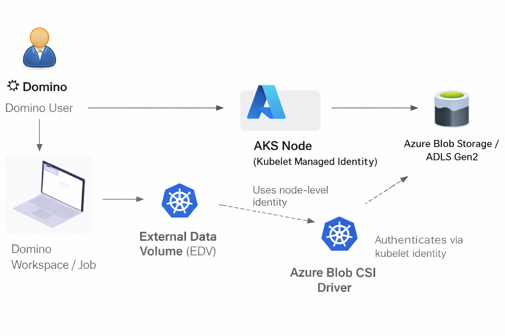
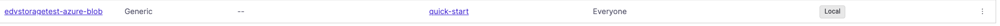
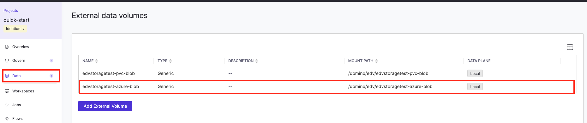

# Azure Blob Storage Mount-Based Access in Domino

## Table of Contents

- [Overview](#overview)
- [Architecture Overview](#architecture-overview)
- [Prerequisites](#prerequisites)
- [Configuration Steps](#configuration-steps)
  - [Step 1: Identify the AKS kubelet managed identity](#step-1-identify-the-aks-kubelet-managed-identity)
  - [Step 2: Verify storage account configuration](#step-2-verify-storage-account-configuration)
  - [Step 3: Verify container exists](#step-3-verify-container-exists)
  - [Step 4: Assign RBAC roles to the kubelet identity](#step-4-assign-rbac-roles-to-the-kubelet-identity)
  - [Step 5: Configure Azure Workload Identity (Alternative to Steps 1–4)](#step-5-configure-azure-workload-identity-alternative-to-steps-1-4)
  - [Step 6: Verify Azure Blob CSI driver is enabled](#step-6-verify-azure-blob-csi-driver-is-enabled)
  - [Step 7: Create a StorageClass](#step-7-create-a-storageclass)
  - [Step 8: Create PersistentVolume and PersistentVolumeClaim](#step-8-create-persistentvolume-and-persistentvolumeclaim)
  - [Step 9: Verify PVC binding](#step-9-verify-pvc-binding)
  - [Step 10: Register the External Data Volume in Domino](#step-10-register-the-external-data-volume-in-domino)
- [Validation](#validation)
- [Troubleshooting](#troubleshooting)
- [Security Considerations](#security-considerations)
- [Limitations](#limitations)

---

## Overview

This guide describes how to expose **Azure Blob Storage (ADLS Gen2)** to **Domino** as a **mounted External Data Volume (EDV)** using Kubernetes CSI-based integration on **Azure Kubernetes Service (AKS)**.

The goal is to allow data science teams to work with large datasets stored in Azure Blob Storage through **familiar filesystem paths** inside Domino workspaces, jobs, and apps without copying or synchronizing data into Domino-managed storage.

By mounting object storage in place, this approach enables:

- Direct access to up-to-date data in Azure Blob Storage
- Separation of compute and storage
- Scalable access to large, shared datasets
- Alignment with Azure-native identity and access control models

This guide focuses on **platform-level configuration** using the **Azure Blob CSI driver with BlobFuse2**, and exposes mounted storage to users through Domino External Data Volumes.

### Supported authentication models

Domino supports two Azure-native authentication models for mount-based access to Azure Blob Storage:
- AKS kubelet managed identity 
  - Node-level identity shared across workloads 
  - Simpler to configure 
  - Suitable for platform-wide or non-sensitive datasets
- Azure Workload Identity (optional)
  - Azure AD identity bound to a Kubernetes ServiceAccount 
  - Enables least-privilege, per-EDV or per-namespace access 
  - Does not require storage account keys 
  - Recommended for environments with stronger security or compliance requirements

Both models use the same CSI driver, BlobFuse2 mount mechanism, and Domino EDV abstraction.
The difference is how Azure authentication is performed, not how data is mounted or accessed by users.

From a Domino user’s perspective, the experience is identical: data appears as a standard filesystem path inside workspaces, jobs, and apps.

## Architecture overview

The architecture below illustrates how Azure Blob Storage is exposed to Domino workloads through platform-managed mounting.



At a high level:

- **Azure Blob Storage / ADLS Gen2** remains the system of record
- The **Azure Blob CSI driver (BlobFuse2)** mounts storage at the Kubernetes node level
- Authentication is handled by either
  - **AKS kubelet managed identity**
  - **An Azure Workload Identity bound to a ServiceAccount**
- The mounted path is registered in Domino as an **External Data Volume (EDV)**
- Data is accessible inside Domino workspaces, jobs, and apps as a standard filesystem path (for example, `/mnt/adls/<container>`)

Key components include:

- **Azure Storage Account (Blob / ADLS Gen2)**: Stores data externally in Azure
- **AKS cluster**: Hosts Domino and manages node-level mounts
- **Azure identity (Kubelet or workload)**: Authenticates storage access for all nodes
- **Azure Blob CSI driver**: Performs filesystem translation outside user workloads
- **Domino External Data Volume (EDV)**: Controls how mounted storage is exposed to users

This architecture keeps user workloads unprivileged while enabling filesystem-style access to Azure object storage.

---

## Prerequisites

To expose Azure Blob Storage to Domino as a mounted EDV, the following prerequisites must be met.

You will need:

- Access to the **Azure subscription**
- Access to the **AKS cluster** where Domino is deployed
- **Azure CLI** authenticated with sufficient permissions
- **kubectl** configured for the AKS cluster
- **Domino administrator privileges**

Before proceeding, ensure that:

- An **Azure Storage Account** exists with **ADLS Gen2 (Hierarchical Namespace)** enabled
- The target **blob container** exists
- The **Azure Blob CSI driver** is enabled on the AKS cluster (default for AKS ≥ 1.21)
- You can assign RBAC roles to an Azure identity used by AKS (kubelet managed identity or Workload Identity)

## Configuration Steps

> **Note:** The following steps use the **AKS kubelet managed identity** for authentication.
> If you are using **Azure Workload Identity**, skip to **Step 5**.

### Step 1: Identify the AKS kubelet managed identity

Retrieve the kubelet identity:

```bash
az aks show \
  --resource-group <AKS_RESOURCE_GROUP> \
  --name <AKS_CLUSTER_NAME> \
  --query identityProfile.kubeletidentity \
  --output json
```
Expected output:

```json
{
  "clientId": "<KUBELET_CLIENT_ID>",
  "objectId": "<KUBELET_OBJECT_ID>",
  "resourceId": "<KUBELET_RESOURCE_ID>"
}
```

Save the Object ID, which is used for RBAC role assignments.

### Step 2: Verify Storage Account Configuration

Confirm that Hierarchical Namespace (HNS) is enabled:
```bash
# Check if Hierarchical Namespace is enabled
az storage account show \
  --name edvstoragetest \
  --resource-group <resource_group_name> \
  --query "{Name:name, HnsEnabled:isHnsEnabled, Sku:sku.name, Location:location}" \
  --output table

# Expected output:
# Name             HnsEnabled    Sku            Location
# ---------------  ------------  -------------  ----------
# edvstoragetest   True          Premium_LRS    westus2
```
If HnsEnabled is `false` or `null`, the storage account must be migrated to ADLS Gen2 before continuing.

---

### Step 3: Verify Container Exists
```bash
# List all containers in the storage account
az storage container list \
  --account-name edvstoragetest \
  --auth-mode login \
  --query "[].name" \
  --output table

# Check if specific container exists
az storage container show \
  --name adls-container-test2 \
  --account-name edvstoragetest \
  --auth-mode login
```

**If container doesn't exist**, create it following the steps [here](https://learn.microsoft.com/en-us/cli/azure/storage/container?view=azure-cli-latest)

---

### Step 4: Assign RBAC Roles to Kubelet Identity

The kubelet identity requires **specific roles** to mount and access blob storage:

#### Reader (Resource Group Scope)

Allows discovery of the storage account within the resource group.
```bash
az role assignment create \
  --role "Reader" \
  --assignee <KUBELET_OBJECT_ID> \
  --scope "/subscriptions/<SUBSCRIPTION_ID>/resourceGroups/<STORAGE_RESOURCE_GROUP>"
```

#### Storage Blob Data Contributor (Storage Account Scope)

Allows read/write access to blob data.
```bash
az role assignment create \
  --role "Storage Blob Data Contributor" \
  --assignee <KUBELET_OBJECT_ID> \
  --scope "/subscriptions/<SUBSCRIPTION_ID>/resourceGroups/<STORAGE_RESOURCE_GROUP>/providers/Microsoft.Storage/storageAccounts/<STORAGE_ACCOUNT_NAME>"
```

#### Storage Account Key Operator Service Role (Storage Account Scope)

**CRITICAL:** This role allows the CSI driver to retrieve storage account keys for mounting.
```bash
az role assignment create \
  --role "Storage Account Key Operator Service Role" \
  --assignee <KUBELET_OBJECT_ID> \
  --scope "/subscriptions/<SUBSCRIPTION_ID>/resourceGroups/<STORAGE_RESOURCE_GROUP>/providers/Microsoft.Storage/storageAccounts/<STORAGE_ACCOUNT_NAME>"
```

#### Verify Role Assignments
```bash
# List all roles assigned to kubelet identity
az role assignment list \
  --assignee <KUBELET_OBJECT_ID> \
  --all \
  --query "[].{Role:roleDefinitionName, Scope:scope}" \
  --output table

# Expected output should include:
# Reader                                    .../resourceGroups/metlife96619
# Storage Blob Data Contributor             .../storageAccounts/edvstoragetest
# Storage Account Key Operator Service Role .../storageAccounts/edvstoragetest
```

### Step 5: Configure Azure Workload Identity (Alternative to Steps 1–4)

> **Important:** If you follow Step 5, skip Steps 1–4 (do not do both).

If you are using **Azure Workload Identity**, complete Step 5 and then continue to **Step 6**.

This approach uses a **dedicated Azure AD managed identity** bound to a Kubernetes ServiceAccount and does not require storage account keys.

#### Verify AKS OIDC Issuer is Enabled

```bash
az aks show \
  --resource-group <AKS_RESOURCE_GROUP> \
  --name <AKS_CLUSTER_NAME> \
  --query "oidcIssuerProfile.issuerUrl" \
  --output tsv
```
If no value is returned, enable OIDC and Workload Identity:

```bash
az aks update \
  --resource-group <AKS_RESOURCE_GROUP> \
  --name <AKS_CLUSTER_NAME> \
  --enable-oidc-issuer \
  --enable-workload-identity
```
Save the OIDC issuer URL for later use.

#### Create a User-Assigned Managed Identity
>> Note: This step can be completed using either the [Azure Portal](https://learn.microsoft.com/en-us/entra/identity/managed-identities-azure-resources/manage-user-assigned-managed-identities-azure-portal) or the [Azure CLI](https://learn.microsoft.com/en-us/cli/azure/identity?view=azure-cli-latest#az-identity-create).
```bash
az identity create \
  --name <MANAGED_IDENTITY_NAME> \
  --resource-group <IDENTITY_RESOURCE_GROUP>
```

Retrieve and save the identity values:
```bash
# Client ID (used for ServiceAccount annotation)
az identity show \
  --name <MANAGED_IDENTITY_NAME> \
  --resource-group <IDENTITY_RESOURCE_GROUP> \
  --query clientId \
  --output tsv

# Principal ID (used for RBAC)
az identity show \
  --name <MANAGED_IDENTITY_NAME> \
  --resource-group <IDENTITY_RESOURCE_GROUP> \
  --query principalId \
  --output tsv
```

#### Assign RBAC Role to the Managed Identity

Grant data-plane access at the storage account scope:
```bash
az role assignment create \
  --role "Storage Blob Data Contributor" \
  --assignee <MANAGED_IDENTITY_PRINCIPAL_ID> \
  --scope "/subscriptions/<SUBSCRIPTION_ID>/resourceGroups/<STORAGE_RESOURCE_GROUP>/providers/Microsoft.Storage/storageAccounts/<STORAGE_ACCOUNT_NAME>"
```
> **Note:** The `Storage Account Key Operator Service Role` is not required when using Workload Identity.

#### Create Federated Identity Credential

Create the federated trust between AKS and Azure AD.

```bash
az identity federated-credential create \
  --name <FEDERATED_CREDENTIAL_NAME> \
  --identity-name <MANAGED_IDENTITY_NAME> \
  --resource-group <IDENTITY_RESOURCE_GROUP> \
  --issuer <AKS_OIDC_ISSUER_URL> \
  --subject system:serviceaccount:<NAMESPACE>:<SERVICEACCOUNT_NAME> \
  --audience api://AzureADTokenExchange
```
> The `subject` must exactly match the Kubernetes ServiceAccount (`<NAMESPACE>`:`<SERVICEACCOUNT_NAME>`) used by Domino workloads that mount the EDV.

Variables:
- NAMESPACE: Kubernetes namespace where Domino compute runs (for example, domino-compute)
- SERVICEACCOUNT_NAME: Kubernetes ServiceAccount used by Domino workloads to mount the EDV 
- SERVICEACCOUNT_YAML_FILE: Path to the ServiceAccount manifest (for example, workload-identity-serviceaccount.yaml)
- MANAGED_IDENTITY_NAME: User-assigned managed identity name 
- MANAGED_IDENTITY_CLIENT_ID: Managed identity clientId (used in ServiceAccount annotation)
- MANAGED_IDENTITY_PRINCIPAL_ID: Managed identity principalId (used for RBAC)
- FEDERATED_CREDENTIAL_NAME: Federated credential name 
- AKS_OIDC_ISSUER_URL: OIDC issuer URL from the AKS cluster

#### Create Kubernetes ServiceAccount
> **Note:** Domino workloads that mount this EDV must run using the `domino-edv-blob-sa` ServiceAccount (configured at the platform/namespace level). If workloads run under a different ServiceAccount, token exchange will fail and the mount will be denied.

Create the ServiceAccount that will be used by Domino workloads accessing the EDV.
```yaml
apiVersion: v1
kind: ServiceAccount
metadata:
  name: <SERVICEACCOUNT_NAME>
  namespace: domino-compute
  annotations:
    azure.workload.identity/client-id: <MANAGED_IDENTITY_CLIENT_ID>
```
Apply it:
```
kubectl apply -f <SERVICEACCOUNT_YAML_FILE>
```
---

### Step 6: Verify Azure Blob CSI Driver is Enabled

Check that the CSI driver is installed:
```bash
# Check if CSI driver is installed
kubectl get csidriver blob.csi.azure.com

# Expected output:
# NAME                   ATTACHREQUIRED   PODINFOONMOUNT   STORAGECAPACITY
# blob.csi.azure.com     false            false            false

# Check CSI driver pods are running
kubectl get pods -n kube-system -l app=csi-blob-node

# Expected output (multiple pods, one per node):
# NAME                  READY   STATUS    RESTARTS   AGE
# csi-blob-node-xxxxx   4/4     Running   0          10d
# csi-blob-node-yyyyy   4/4     Running   0          10d
```

**If CSI driver is not enabled:**
```bash
az aks update \
  --resource-group <AKS_RESOURCE_GROUP> \
  --name <AKS_CLUSTER_NAME> \
  --enable-blob-driver
```
---
### Step 7: Create StorageClass

Create a StorageClass for blob storage with BlobFuse2 protocol:
```bash
kubectl apply -f - <<EOF
apiVersion: storage.k8s.io/v1
kind: StorageClass
metadata:
  name: azureblob-fuse-premium
provisioner: blob.csi.azure.com
parameters:
  skuName: Premium_LRS
  protocol: fuse2
reclaimPolicy: Retain
volumeBindingMode: Immediate
allowVolumeExpansion: true
mountOptions:
  - -o allow_other
  - --use-adls=true
  - --file-cache-timeout-in-seconds=120
EOF
```

**Verify StorageClass:**
```bash
kubectl get storageclass azureblob-fuse-premium
```

---

### Step 8: Create PersistentVolume and PersistentVolumeClaim

#### Create PersistentVolume
```bash
 kubectl apply -f azure-pv.yml
```
```
apiVersion: v1
kind: PersistentVolume
metadata:
  name: edvstorage-pv-blob-azure
  annotations:
    pv.kubernetes.io/provisioned-by: blob.csi.azure.com
  labels:
    dominodatalab.com/external-data-volume: Generic
spec:
  capacity:
    storage: 10Gi
  accessModes:
    - ReadWriteMany
  persistentVolumeReclaimPolicy: Retain
  storageClassName: azureblob-fuse-premium
  mountOptions:
    - -o allow_other
    - --file-cache-timeout-in-seconds=120
  # Optional: override mount options here if needed (StorageClass already sets --use-adls=true)
  csi:
    driver: blob.csi.azure.com
    volumeHandle: edv-<STORAGE_ACCOUNT_NAME>-<CONTAINER_NAME>-<ENV>
    volumeAttributes:
      containerName: <CONTAINER_NAME>
      resourceGroup: <STORAGE_RESOURCE_GROUP>
      storageAccount: <STORAGE_ACCOUNT_NAME>
      # Workload Identity only:
      # useAzureAD: "true"
  claimRef:
    name: edvstoragetest-azure-blob
    namespace: domino-compute
```
> Workload Identity note: If you used Step 5, uncomment useAzureAD: "true" in volumeAttributes to enable Azure AD (keyless) auth.

#### Create PersistentVolumeClaim
```bash
 kubectl apply -f azure-pvc.yml
```
```
apiVersion: v1
kind: PersistentVolumeClaim
metadata:
  name: edvstoragetest-azure-blob
  namespace: domino-compute
  labels:
    dominodatalab.com/external-data-volume: Generic
spec:
  accessModes:
    - ReadWriteMany
  resources:
    requests:
      storage: 10Gi
  volumeName: edvstorage-pv-blob-azure
  storageClassName: azureblob-fuse-premium
```

### Step 9: Verify PVC Binding
```bash
# Check PersistentVolume status
kubectl get pv edvstorage-pv-blob-azure -n domino-compute

# Expected output:
# NAME                 CAPACITY   ACCESS MODES   RECLAIM POLICY   STATUS   CLAIM
# edvstorage-pv-blob-azure    100Gi      RWX            Retain           Bound    domino-compute/adls-pvc-blob-fuse

# Check PersistentVolumeClaim status
kubectl get pvc edvstoragetest-azure-blob -n domino-compute

# Expected output:
# NAME                 STATUS   VOLUME              CAPACITY   ACCESS MODES
# edvstoragetest-azure-blob   Bound    adls-pv-blob-fuse   100Gi      RWX
```

**If PVC is stuck in "Pending" status, see [Troubleshooting](#troubleshooting) section.**

---

### Step 10: Register External Data Volume in Domino
The above PV should appear as a generic EDV in the EDV section of the admin panel. Configure the EDV per the documentation: https://docs.dominodatalab.com/en/latest/user_guide/f12554/external-data-volumes-edvs/\


---

## Validation

### Attach the EDV to a Domino Project
1. Follow the steps in this [documentation](https://docs.dominodatalab.com/en/cloud/user_guide/ee8d01/add-edvs-to-projects/) to attach the EDV to a Domino Project



2. Browse the EDV and access the Azure Blob Storage


## Troubleshooting

### PVC Stuck in "Pending" Status

```bash
kubectl describe pvc <AZURE_BLOB_PVC_NAME> -n domino-compute
kubectl get pv <AZURE_BLOB_PV_NAME> -o yaml
kubectl get sc azureblob-fuse-premium -o yaml
```

Check CSI driver logs:
```bash
kubectl logs -n kube-system -l app=csi-blob-node --tail=200
```

**Common Causes:**

1. `resourceGroup` missing in PV `volumeAttributes`
2. Missing `resourceGroup` in the PV
3. **Kubelet identity path:** Missing `Storage Account Key Operator Service Role` on the kubelet identity
4. **Workload identity path:** OIDC issuer not enabled, federated credential subject mismatch, or `useAzureAD: "true"` not set for the PV

---

### Mount Succeeded but No Files Visible
**Common Causes:**

1. **Missing `resourceGroup` parameter** in PV `volumeAttributes` (most common)
2. **Wrong storage account name** in PV configuration
3. **Wrong container name** in PV configuration
4. **Missing Storage Account Key Operator role** on kubelet identity


### Permission Denied Errors
- Confirm Storage Blob Data Contributor role
- Confirm Storage Account Key Operator Service Role
- Validate kubelet identity object ID
```
az role assignment list \
  --assignee <KUBELET_OBJECT_ID> \
  --all \
  --query "[].{Role:roleDefinitionName, Scope:scope}" \
  --output table
```

## Security Considerations

### Shared Identity Model

- Access uses a shared kubelet managed identity
- Azure audit logs will show storage access under the kubelet identity
- Use Domino controls and project-level EDV assignment to limit access

### Workload Identity Model

- Access uses a dedicated Azure AD managed identity bound to a Kubernetes ServiceAccount
- No storage account keys are required
- Enables least-privilege access per EDV or namespace (depending on how identities are scoped)

### Limitations

- Access uses a shared kubelet identity
- No per-user Azure identity or auditing
- POSIX semantics are limited by BlobFuse2
- Not recommended for high-frequency small file workloads