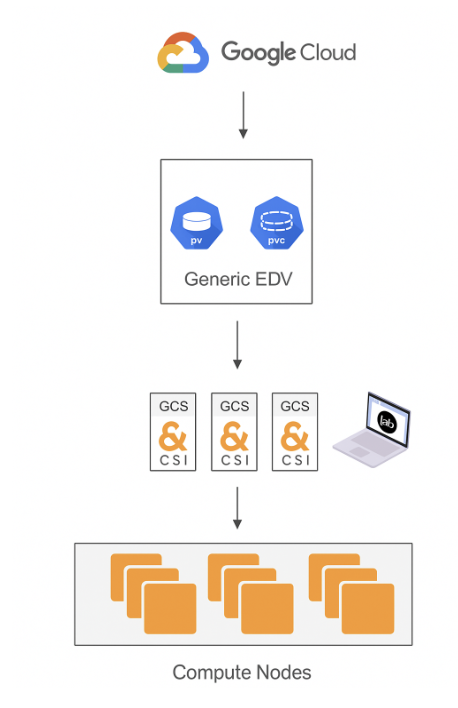
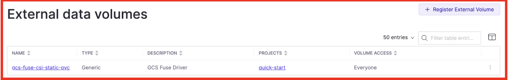
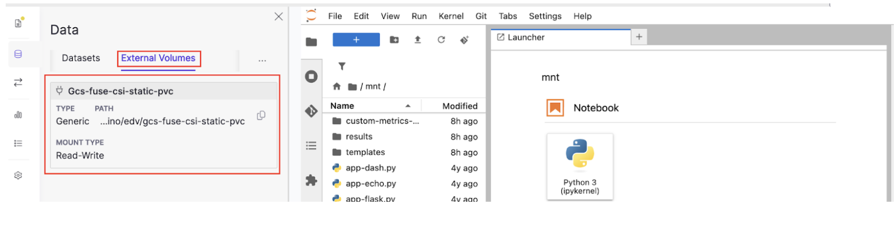
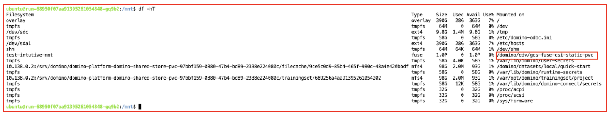

# Google Cloud Storage Mount-Based Access in Domino


## Table of Contents

- [Overview](#overview)
- [Architecture overview](#architecture-overview)
- [Pre Requisites](#pre-requisites)
  - [Configure access to Cloud Storage buckets](#configure-access-to-cloud-storage-buckets)
  - [Set up Kubernetes Persistent Volumes (PV) and Persistent Volume Claims (PVC)](#set-up-kubernetes-persistent-volumes-pv-and-persistent-volume-claims-pvc)
  - [Domino EDV configuration](#domino-edv-configuration)
  - [Install domsed](#install-domsed)
  - [Apply the Workload Identity mutation](#apply-the-workload-identity-mutation)
  - [Apply the GCS FUSE driver annotation mutation](#apply-the-gcs-fuse-driver-annotation-mutation)
- [Validation](#validation)
- [Troubleshooting](#troubleshooting)
  - [Volume not mounted in workspace or job](#volume-not-mounted-in-workspace-or-job)
  - [Permission denied or GCS access errors](#permission-denied-or-gcs-access-errors)
  - [Workspace fails to start due to volume errors](#workspace-fails-to-start-due-to-volume-errors)

## Overview

This guide describes how to expose a **Google Cloud Storage (GCS) bucket** to **Domino** as a **mounted External Data Volume (EDV)** using Kubernetes CSI-based integration.

The intent is to allow data science teams to work with large datasets stored in GCS through **familiar filesystem paths** inside Domino workspaces, jobs, and apps—without copying data into Domino-managed storage.

By mounting object storage in place, this approach enables:
- direct access to up-to-date data in GCS
- separation of compute and storage
- scalability for large, shared datasets
- alignment with Google Cloud identity and data governance practices

This guide focuses on the **platform-level configuration** required to mount GCS-backed storage into Domino using the **Cloud Storage FUSE CSI driver**, and to surface it to users as a Domino EDV.

---
## Architecture overview

The architecture below illustrates how a Google Cloud Storage bucket is exposed to Domino workloads through platform-managed mounting.



At a high level:
- **Google Cloud Storage** remains the system of record
- The **CSI driver** mounts the bucket at the Kubernetes/platform layer
- The mounted path is registered in Domino as an **External Data Volume (EDV)**
- Data becomes accessible inside Domino workspaces, jobs, and apps as a standard filesystem path (for example, `/mnt/gcs/<bucket>`)

Key components include:

- **GCS bucket**: Stores data externally in Google Cloud.

- **Cloud Storage FUSE CSI driver**: Integrates Kubernetes with GCS and handles filesystem translation outside user workloads.

- **Domino External Data Volume (EDV)**: Defines how the mounted storage is exposed to Domino projects and users.

- **Domino compute environment**: Workspaces, jobs, and apps where the mounted GCS data is accessed during execution.

This architecture keeps user workloads unprivileged while allowing data scientists to interact with cloud object storage using standard filesystem operations.

## Pre Requisites

To expose a Google Cloud Storage (GCS) bucket to Domino as a mounted External Data Volume (EDV), the following prerequisites must be met.

You will need:
- Access to the **GCP project** to configure storage and identity
- Access to the **Kubernetes cluster** where Domino is deployed
- **Domino administrator privileges** to create and manage EDVs

Before proceeding, ensure that:

- A **[GCS bucket](https://docs.cloud.google.com/storage/docs/creating-buckets)** exists and contains the data to be shared
- **[Workload Identity](https://docs.cloud.google.com/kubernetes-engine/docs/how-to/workload-identity#enable_on_clusters_and_node_pools)** is enabled for the GKE cluster to allow secure, identity-based access to GCS
- The **[Cloud Storage FUSE CSI driver](https://docs.cloud.google.com/kubernetes-engine/docs/how-to/cloud-storage-fuse-csi-driver-setup#autopilot)** is enabled on the cluster

These prerequisites ensure that cloud object storage can be mounted at the platform layer and safely exposed to Domino workspaces through EDVs.

### Configure access to Cloud Storage buckets

The Cloud Storage FUSE CSI driver uses **[Workload Identity Federation for GKE](https://docs.cloud.google.com/kubernetes-engine/docs/how-to/workload-identity)** to authenticate Kubernetes workloads to Google Cloud Storage. This allows you to grant **fine-grained, least-privilege IAM permissions** to GKE pods without embedding service account keys or credentials.

Before mounting a GCS bucket into Domino, ensure that:
- Workload Identity is enabled on the GKE cluster
- A Google Cloud service account with appropriate Cloud Storage permissions is configured
- The service account is bound to the Kubernetes service account used by the CSI driver or Domino platform components

For detailed setup instructions, refer to the official GCP documentation on [Cloud Storage FUSE CST Driver Setup](https://docs.cloud.google.com/kubernetes-engine/docs/how-to/cloud-storage-fuse-csi-driver-setup#authentication) for steps to set this up.

### Set up Kubernetes Persistent Volumes (PV) and Persistent Volume Claims (PVC)

Domino External Data Volumes (EDVs) are backed by Kubernetes Persistent Volumes. To expose mounted cloud storage to Domino, define a Persistent Volume (PV) and a corresponding Persistent Volume Claim (PVC).

The PVC must:
- Be created in the **Domino compute namespace**
- Include the label `domino-datalab.com/external-data-volume`
- Use the **Generic** EDV type

Below is an example PV and PVC definition.

```yaml
apiVersion: v1
kind: PersistentVolume
metadata:
  name: gcs-fuse-csi-pv
  labels:
    dominodatalab.com/external-data-volume: Generic
spec:
  capacity:
    storage: 10Gi
  accessModes:
    - ReadWriteMany
  persistentVolumeReclaimPolicy: Retain
  storageClassName: gcs-fuse
  mountOptions:
    - implicit-dirs
  csi:
    driver: gcsfuse.csi.storage.gke.io
    volumeHandle: <gcs-bucket-name>
  claimRef:
    name: gcs-fuse-csi-pvc
    namespace: domino-compute
---
apiVersion: v1
kind: PersistentVolumeClaim
metadata:
  name: gcs-fuse-csi-pvc
  namespace: domino-compute
  labels:
    dominodatalab.com/external-data-volume: Generic
spec:
  accessModes:
    - ReadWriteMany
  storageClassName: gcs-fuse
  resources:
    requests:
      storage: 10Gi
```

Then apply the above configuration with:

```
kubectl apply -f static_provisioning_domino.yaml
```

**Important:** Ensure that each mounted GCS bucket uses a **unique `volumeHandle`** value. Reusing a `volumeHandle` across volumes can result in mount conflicts.

### Domino EDV configuration

The above PV should appear as a generic EDV in the EDV section of the admin panel. Configure the EDV per the [documentation](https://docs.dominodatalab.com/en/latest/user_guide/f12554/external-data-volumes-edvs/)
A successful setup of the EDV should look like the below screenshot.



### Install domsed

`domsed` is a lightweight component used to apply targeted patches to Kubernetes resources created by Domino. It runs as a **mutating admission controller**, allowing specific adjustments to be made at resource creation time without modifying Domino-managed manifests directly.

If `domsed` encounters an error, Kubernetes falls back to the original resource specification generated by Domino. This fail-safe behavior ensures that misconfigurations or patching issues do not disrupt Domino workloads.

Installation and configuration of `domsed` must be performed in coordination with **Domino Professional Services**, as it requires platform-level access and alignment with supported Domino deployment patterns.

### Apply the Workload Identity mutation

> **Prerequisite:** This step requires a successful installation of `domsed`, as the mutation is applied using Domino’s mutating admission controller.

To allow Domino jobs to access GCS-backed EDVs securely, a **Workload Identity mutation** is applied. This mutation automatically attaches the appropriate **GCP Workload Identity** to jobs that mount a specific EDV-backed PVC, eliminating the need for service account keys or manual credential injection.

The mutation watches for Kubernetes Jobs that reference the PVC backing the EDV and injects the configured GCP service account at runtime.

```yaml
apiVersion: apps.dominodatalab.com/v1alpha1
kind: Mutation
metadata:
  name: cloud-workload-identity-shared-store
  namespace: domino-platform
rules:
  - jqSelector:
      query: |
        include "domsed/selectors/common";
        ($__kind__ == "Job" or $__kind__ == "Deployment") and 
        (.spec.template.spec.volumes != null) and 
        (.spec.template.spec.volumes[] | select(.persistentVolumeClaim.claimName != null) | select(.persistentVolumeClaim.claimName == "<PVC-NAME>")) != null
    cloudWorkloadIdentity:
      cloud_type: gcp
      user_mappings: {}
      default_sa: "<SERVICE-ACCOUNT-NAME>"
    userEvents:
      customMessage: "GCP workload identity applied for shared store access"
      enabled: true
```
Before applying the mutation, update the following values:

- Replace `<PVC-NAME>` with the name of the PVC backing the EDV
- Replace `<SERVICE-ACCOUNT-NAME>` with the GCP service account to use (for example, `gcs-intuitive`)

```bash
kubectl apply -f workload-identity-mutation.yaml
```
### Apply the GCS FUSE driver annotation mutation

To ensure compatibility with the **GKE Cloud Storage FUSE CSI driver**, Domino applies an annotation mutation to any **Job or Workspace** that mounts the PVC backing the EDV. This annotation is required for the GCS-backed volume to be recognized and mounted correctly by the CSI driver.

Without this annotation, the GCS volume will not be mounted.

```yaml
apiVersion: apps.dominodatalab.com/v1alpha1
kind: Mutation
metadata:
  name: <GCS_ANNOTATION_MUTATION_NAME>
  namespace: domino-platform
rules:
- jqSelector:
    query: |
      select(.spec.volumes != null)
      | .spec.volumes[]
      | select(.persistentVolumeClaim.claimName != null)
      | select(.persistentVolumeClaim.claimName == "<PVC_NAME>")
  modifyAnnotation:
    key: "gke-gcsfuse/volumes"
    value: "true"
```
Before applying the mutation:

- Replace `<GCS_ANNOTATION_MUTATION_NAME>` with a name for the mutation
- Replace `<PVC_NAME>` with the name of the PVC backing the EDV

Apply the mutation:

```bash
kubectl apply -f <GCS_ANNOTATION_MUTATION_FILE>.yaml
```
Verify that the mutation is registered:
```
kubectl get mutation -n domino-platform
```

## Validation

1. Follow steps [here](https://docs.dominodatalab.com/en/6.0/user_guide/ee8d01/add-edvs-to-projects/) to add EDV to a project and create a workspace with the EDV mounted
2. Browse the EDV and access the GCS bucket



3. Observe the file system mounts



## Troubleshooting

### Volume not mounted in workspace or job

You don’t see the expected files in `/mnt/gcs/...`, or the mount path is empty.

- Is the correct External Data Volume (EDV) attached to the project?
- Did the job or workspace use the correct PVC name (`gcs-fuse-csi-static-pvc`)?
- Was the pod annotated with `gke-gcsfuse/volumes: true`?

Check pod annotations:

```bash
kubectl describe pod <pod-name>
```

Check logs of the GCS FUSE CSI driver:
```bash
kubectl logs -n kube-system -l app=gcsfuse-csi-driver
```

### Permission denied or GCS access errors

You see errors such as:

- 403 Permission Denied 
- Cannot list objects
- Invalid or missing credentials 
- Verify that the Workload Identity mutation is applied 
- Confirm the job is using the correct PVC 
- Check the GCP service account configured in the mutation (default_sa)
- Ensure the service account has the required IAM roles:
  - roles/storage.objectViewer for read-only access 
  - roles/storage.admin for read-write access

### Workspace fails to start due to volume errors
The pod is stuck in `ContainerCreating` or enters `CrashLoopBackOff`.
- Check pod events:
  ```
  kubectl describe pod <pod-name> -n domino-compute
  ```
- Confirm the PVC exists and is bound:
  ```
  kubectl get pvc -n domino-compute
  ```
