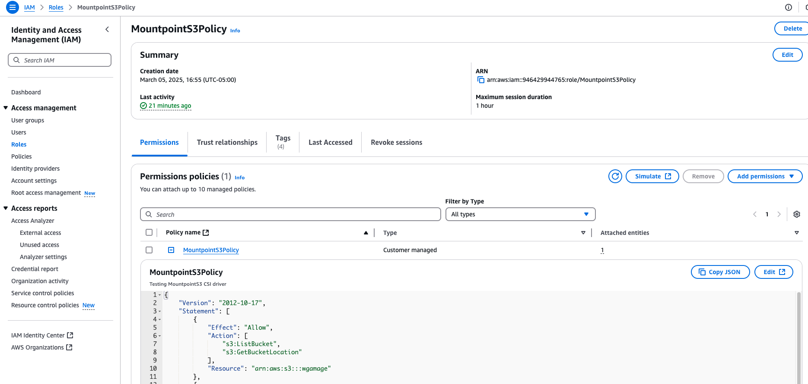
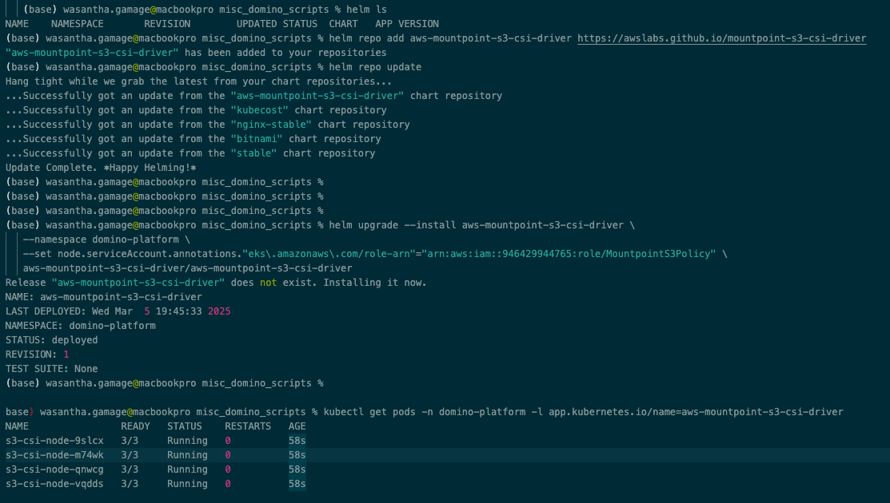

# Mountpoint S3 as an Alternative to FUSE


## Table of Contents

- [Overview](#overview)
- [Pre Requisites](#pre-requisites)
- [Setup mountpoint for Amazon S3 CSI driver](#setup-mountpoint-for-amazon-s3-csi-driver)
  - [AWS IAM Configuration](#aws-iam-configuration)
  - [EKS cluster configuration](#eks-cluster-configuration)
  - [Domino EDV configuration](#domino-edv-configuration)
- [Validation](#validation)
- [Troubleshooting](#troubleshooting)
- [Limitations](#limitations)

## Overview

[FUSE (Filesystem in Userspace)](https://github.com/s3fs-fuse/s3fs-fuse) can be a very convenient way to extend file system functionality.

Since FUSE requires some level of privilege to operate (e.g., access to `/dev/fuse`), it can expose additional attack surfaces if not tightly controlled. In containerized environments, this can complicate security policies, especially in unprivileged setups like in Domino.

FUSE is popular among Life Science customers, and many Domino users would like to use the file browsing experience inside Domino.

The [AWS mountpoint for Amazon S3 CSI driver](https://github.com/awslabs/mountpoint-s3-csi-driver/tree/main) accomplishes the user requirements while addressing the security concerns.


The AWS mountpoint for the Amazon S3 CSI driver will configure the fuse file system at the compute node level. Domino EDV can be used to provide controlled access from the workspaces to the underlying FUSE file system.

## Pre Requisites

Setting up mountpoint for the Amazon S3 CSI driver requires access to the AWS account for configuration changes as well as Kubernetes access and Domino administrator access.

## Setup mountpoint for Amazon S3 CSI driver

Follow the instructions here: https://github.com/awslabs/mountpoint-s3-csi-driver/blob/main/docs/install.md

### AWS IAM Configuration

Create an IAM policy to allow access to the S3 bucket. You can add multiple S3 buckets to the same IAM policy.

```json
{
    "Version": "2012-10-17",
    "Statement": [
        {
            "Effect": "Allow",
            "Action": [
                "s3:ListBucket",
                "s3:GetBucketLocation"
            ],
            "Resource": "arn:aws:s3:::wgamage"
        },
        {
            "Effect": "Allow",
            "Action": [
                "s3:PutObject",
                "s3:GetObject",
                "s3:DeleteObject"
            ],
            "Resource": "arn:aws:s3:::wgamage/*"
        }
    ]
}
```

Create a role using the attached policy above. The example was completed in CloudShell with eksctl.

```bash
eksctl create iamserviceaccount \
    --name s3-csi-driver-sa \
    --namespace domino-platform \
    --cluster wgamage73590 \
    --attach-policy-arn arn:aws:iam::<AWS account ID>:policy/MountpointS3Policy \
    --approve \
    --role-name MountpointS3Policy \
    --region US-WEST-2 \
    --role-only
```

Example:


**Note:** Note down the role ARN.



### EKS cluster configuration

Deploy the mount point S3 CSI driver. Replace the EKS cluster name and the role ARN created earlier.

```bash
helm repo add aws-mountpoint-s3-csi-driver https://awslabs.github.io/mountpoint-s3-csi-driver
helm repo update

helm upgrade --install aws-mountpoint-s3-csi-driver \
   --namespace domino-platform \
   --set node.serviceAccount.annotations."eks\.amazonaws\.com/role-arn"="arn:aws:iam::<AWS account ID>:role/MountpointS3Policy" \
   aws-mountpoint-s3-csi-driver/aws-mountpoint-s3-csi-driver
```

Example:

Deploy the PV and PVC:

```yaml
apiVersion: v1
kind: PersistentVolume
metadata:
  name: mountpoints3-pv
spec:
  capacity:
    storage: 10Gi # Ignored, required
  accessModes:
    - ReadWriteMany # Supported options: ReadWriteMany / ReadOnlyMany
  storageClassName: "" # Required for static provisioning
  claimRef: # To ensure no other PVCs can claim this PV
    namespace: domino-compute # Namespace is required even though it's in "default" namespace.
    name: mountpoints3-pvc # Name of your PVC
  mountOptions:
    - uid=12574
    - gid=12574
    - allow-other
    - allow-overwrite
    - allow-delete
    - region=us-west-2
  csi:
    driver: s3.csi.aws.com # Required
    volumeHandle: s3-csi-driver-volume
    volumeAttributes:
      bucketName: wgamage
---
apiVersion: v1
kind: PersistentVolumeClaim
metadata:
  name: mountpoints3-pvc
  namespace: domino-compute 
  labels:
      dominodatalab.com/external-data-volume: Generic
spec:
  accessModes:
    - ReadWriteMany # Supported options: ReadWriteMany / ReadOnlyMany
  storageClassName: "" # Required for static provisioning
  resources:
    requests:
      storage: 10Gi # Ignored, required
  volumeName: mountpoints3-pv # Name of your PV
```

Then apply the above configuration with:

```bash
kubectl apply -f examples/kubernetes/static_provisioning/static_provisioning_domino.yaml
```

**Important:** Make sure to have a unique `volumeHandle` for each S3 bucket you are mounting.

### Domino EDV configuration

The above PV should appear as a generic EDV in the EDV section of the admin panel. Configure the EDV per the documentation: https://docs.dominodatalab.com/en/latest/user_guide/f12554/external-data-volumes-edvs/


## Validation

1. Create a workspace with the EDV mounted
2. Browse the EDV and access the S3 bucket


3. Observe the file system mounts


4. Run throughput tests (optional)


## Troubleshooting

### Confirm the S3 CSI node daemonset pods are running


Check the status of the daemonset pods in your cluster.

### Check if the compute node has the mountpoint-s3 file system mounted

Verify that the file system is properly mounted on the compute nodes.


## Limitations

For detailed limitations, refer to the AWS documentation: https://docs.aws.amazon.com/AmazonS3/latest/userguide/mountpoint.html