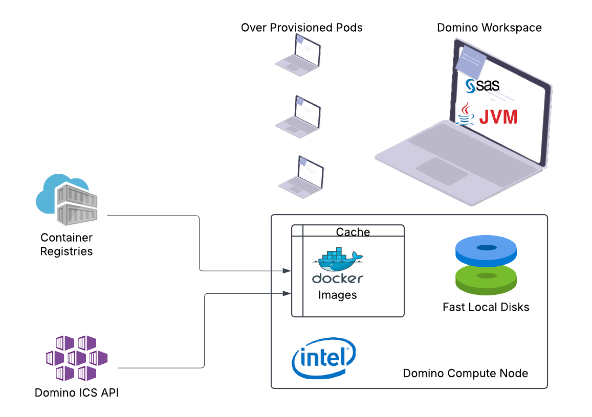
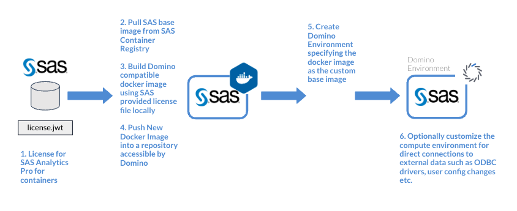
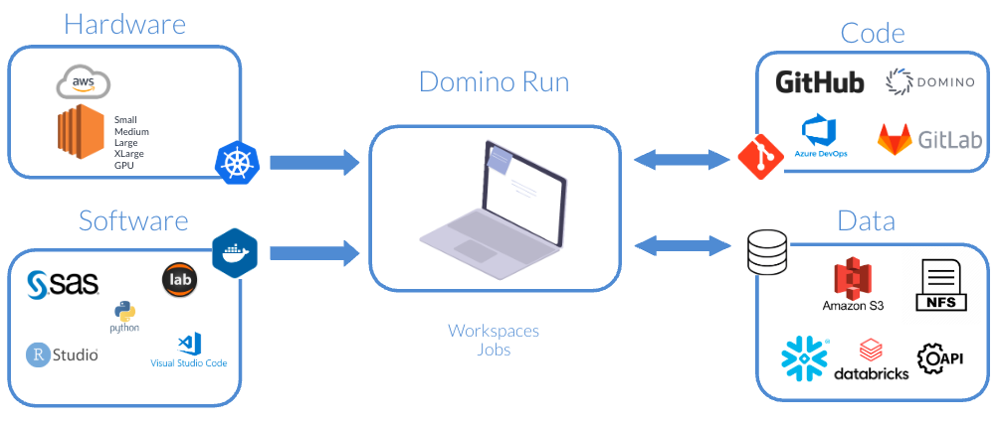
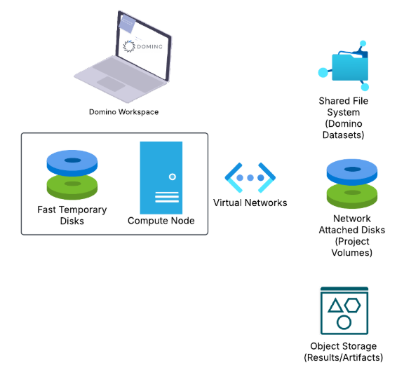

# Tuning SAS for the Cloud: How to Run High-Performance SAS Workloads on Domino

---

## Table of Contents
1. [Overview](#overview)  
2. [SAS on Domino Architecture](#sas-on-domino-architecture)  
3. [Enable Image Caching](#enable-image-caching)  
4. [Use Intel-based Compute](#use-intel-based-compute)  
5. [Optimize Container Image Pulls](#optimize-container-image-pulls)  
   - [Use Private Networking for Registry Access](#use-private-networking-for-registry-access)  
   - [Bake Images into Node AMIs](#bake-images-into-node-amis)  
   - [Enable Image Streaming (Where Supported)](#enable-image-streaming-where-supported)  
6. [Choose High-Capacity Compute Nodes](#choose-high-capacity-compute-nodes)  
7. [Storage Recommendations](#storage-recommendations)  
   - [Use High-Performance Storage for Datasets](#use-high-performance-storage-for-datasets)  
   - [Use Fast Local Disks for SAS Work/UTILS Directory](#use-fast-local-disks-for-sas-workutils-directory)  
8. [Tune SAS Memory and JVM Settings for Containerized Environments](#tune-sas-memory-and-jvm-settings-for-containerized-environments)  
   - [Set an Appropriate MEMSIZE](#set-an-appropriate-memsize)  
   - [Tune JVM Stack Size (Optional)](#tune-jvm-stack-size-optional)

---

## Overview


SAS has traditionally been deployed on static, on-premises infrastructure where system resources are manually tuned and permanently provisioned. However, running SAS on modern, cloud-based, on-demand platforms like Domino introduces new considerations—especially around resource management, performance tuning, and storage I/O.

This guide is intended for users and organizations transitioning from on-prem SAS deployments (e.g., Viya or SAS 9.4) to SAS Analytics Pro on Domino. Domino customers are already running SAS successfully at scale, and this document shares key learnings and best practices to help you get the most out of SAS in a containerized, Kubernetes-based cloud environment.

By following these recommendations, you'll better align SAS's performance characteristics with the elasticity, scaling, and storage patterns of cloud-native infrastructure and ensure a smoother, faster user experience on Domino.

## SAS on Domino Architecture
SAS can be run on Domino as containerized workloads. Domino SAS compute environment images are created based on the containerized SAS images available for licensed customers.



Once SAS Compute Environment images are available in Domino, SAS workloads can be run as Domino workspaces for interactive development and jobs for non-interactive workloads.



## Enable Image Caching
Domino offers an image caching service that stores frequently used compute environments on compute nodes. Enabling this service can significantly reduce environment startup time by avoiding repeated image pulls.  
[Learn more about Domino image caching](https://docs.dominodatalab.com/en/latest/admin_guide/7f4331/install-configuration-reference/#_image_caching)

## Use Intel-based Compute
SAS is optimized for Intel architecture, particularly for performance-critical libraries and numeric computation. It is recommended to use compute nodes backed by Intel-based virtual machines or hardware for best performance.  
[More on SAS optimization](https://learn.microsoft.com/en-us/azure/architecture/guide/sas/sas-overview#ls-series)

## Use Domino Overprovisioning
In cloud deployments with autoscaling, node startup can take several minutes, especially in the mornings when demand spikes. You can improve SAS user experience by enabling Domino's overprovisioning feature:

- Schedule warm slots for popular SAS hardware tiers
- Domino will pre-provision nodes ahead of time
- Reduces user wait time by minimizing cold starts

[More on Overprovisioning] (https://docs.dominodatalab.com/en/cloud/admin_guide/4f943d/advanced-hardware-tier-settings/#overprovison-pod)

## Optimize Container Image Pulls
Container image pull time can impact the startup latency of SAS environments, especially when working with large Docker images. Several strategies can help reduce this overhead across cloud providers.

### Use Private Networking for Registry Access
If your platform supports private connectivity to its container registry (e.g., AWS ECR with VPC Endpoints, Azure Private Link for ACR), enable it to:
- Reduce network hops
- Avoid public internet throttling
- Ensure more consistent pull performance  
[Learn about AWS ECR VPC Endpoints](https://docs.aws.amazon.com/AmazonECR/latest/userguide/vpc-endpoints.html)

### Bake Images into Node AMIs
On platforms like AWS, you can create custom Amazon Machine Images (AMIs) with your SAS container images preloaded. This ensures:
- Containers start instantly (no pull needed)
- Ideal for bursty workloads or autoscaling scenarios  
[Improving container launch time with image preloading](https://aws.amazon.com/blogs/containers/improving-container-launch-time-with-image-caching-and-preloading/)

### Enable Image Streaming (Where Supported)
Some cloud platforms offer artifact streaming that allows containers to start before the full image is pulled. Where streaming is available, enabling it can reduce cold start time for large images.  
[Azure ACR Artifact Streaming](https://learn.microsoft.com/en-us/azure/aks/artifact-streaming)

## Choose High-Capacity Compute Nodes
Some cloud Kubernetes services limit the number of pods per node based on networking configurations (e.g., CNI plugins). Choosing higher-capacity VM types allows more SAS workloads per node, helping optimize resource utilization within platform limits.  
[Example: Kubernetes pod scaling limits](https://learn.microsoft.com/en-gb/azure/aks/azure-cni-overlay?tabs=kubectl)

## Storage Recommendations
The following shows a typical storage architecture of the Domino platform.



Domino workspaces and jobs use project volumes as temporary local disks. Domino backs up results, artifacts, and code in Domino File System (DFS)-based projects to cloud object storage. Domino Datasets provide a convenient way to store and share data across projects and users. Datasets are typically backed by shared file systems provisioned through the cloud provider.

### Use High-Performance Storage for Datasets
For I/O-intensive applications like SAS, the performance characteristics of the underlying shared storage can significantly impact read/write speeds.

Standard or basic tiers may have limited throughput and higher latency, which can slow down SAS operations.

Premium/enterprise tiers offer:
- Higher throughput per IOPS
- Lower latency
- Better scaling for concurrent users

When using Datasets with SAS, ensure they are backed by premium or enterprise-tier storage.  
[Storage performance guidance (Azure example)](https://learn.microsoft.com/en-us/azure/storage/files/storage-files-scale-targets)

### Use Fast Local Disks for SAS Work/UTILS Directory
SAS workloads generate significant I/O in temporary areas like the `WORK` and `UTILLOC` directories. Using locally attached or ephemeral disks (e.g., NVMe, AWS instance store, or Azure temporary disks) for these directories greatly improves performance over network-attached storage.

| Directory                | Description |
|--------------------------|-------------|
| **WORK**                 | Stores temporary datasets and files created during a SAS session. Efficient I/O is critical. |
| **UTILLOC**              | Stores utility files for sorting and merging. Often shares the WORK location unless configured separately. |
| **SAS_HOME**             | Contains core SAS installation binaries. |
| **SAS_CONFIG**           | Stores configuration files for SAS runtime. |

[Temporary Disk performance overview (Azure)](https://learn.microsoft.com/en-us/azure/virtual-machines/managed-disks-overview)  
[AWS Instance Store Overview](https://docs.aws.amazon.com/AWSEC2/latest/UserGuide/InstanceStorage.html)

## Tune SAS Memory and JVM Settings for Containerized Environments
When running SAS on Domino (or any Kubernetes-based platform), SAS workloads execute inside containers (pods). By default, SAS does not automatically consume all memory available to the container, which can lead to suboptimal performance for memory-intensive workloads.

Even if a Domino workspace has 16 GB of memory, SAS may only use a small portion unless explicitly configured. This is controlled by the `MEMSIZE` parameter, which defines how much memory a SAS session can use.

### Set an Appropriate MEMSIZE
To maximize performance, set `MEMSIZE` based on the Domino workspace’s memory allocation while reserving headroom for:
- Java processes (used in SAS Studio)
- OS-level container overhead
- SAS helper threads and utilities

**Rule of Thumb:** Set `MEMSIZE` to 80–90% of the Workspace Hardware Tier memory

| Workspace Memory | Recommended MEMSIZE |
|------------------|----------------------|
| 18 GB            | 16 GB (`memsize=16G`) |
| 36 GB            | 32 GB (`memsize=32G`) |

These values can be added to `/opt/sas/viya/home/SASFoundation/sasv9_local.cfg` using Domino setup scripts.

### Tune JVM Stack Size (Optional)
SAS Studio and several other Viya components (e.g., SAS/ACCESS engines, graphical interfaces, web services) rely on the Java Virtual Machine (JVM) for execution. The JVM stack size controls the amount of memory allocated per thread for call stacks and local variables.

Errors such as `StackOverflowError` usually stem from insufficient stack size per thread, which is controlled by the `-Xss` JVM option.

You can configure this with:
```bash
export SASV9_OPTIONS='-JREOPTIONS ( -Xss2048k )'
```

Or by adding the option to:  
`/opt/sas/viya/home/SASFoundation/sasv9_local.cfg`
