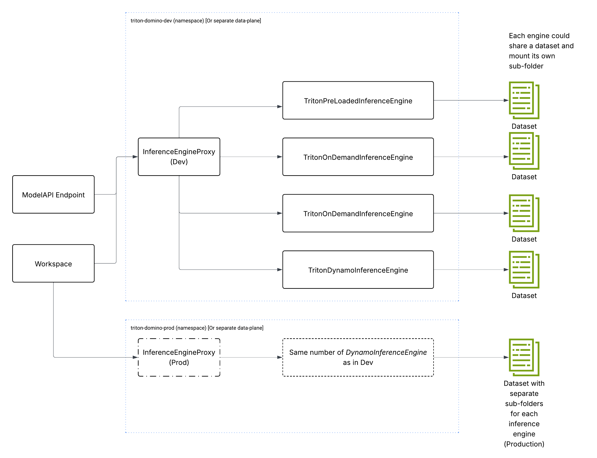

# 🕊️ Plugin framework to install Inference Servers 🕊️

THIS IS ONLY A REFERENCE IMPLEMENTATION - DO NOT USE IN PRODUCTION!!

The goal is to provide a **pluggable framework** for integrating state-of-the-art inference engines. The current implementation supports **NVIDIA Triton Inference Server**, with each engine deployed in its own Kubernetes namespace. This enables environment isolation — for example, separate **DEV**, **TEST**, and **PROD** setups.

When using **NEXUS**, these environments can alternatively be represented through distinct **data planes**, offering even more flexible deployment models.

This architecture integrates seamlessly with the **Domino Model API**, which simply proxies inference requests to the appropriate endpoint within the inference engine.

### Key Benefits

1. **Improved resource efficiency**  
   Enables GPU/CPU sharing for low-utilization models, resulting in significant cost savings.

2. **Workload-aware optimization**  
   Inference engines should be selected based on task characteristics — it’s not a one-size-fits-all decision.

3. **Operational flexibility**  
   Different inference types require different observability and management strategies. For example, **specialized LLM 
   engines like NVIDIA Dynamo** demand distinct monitoring compared to general-purpose engines like Triton.

---

Inference engines help strike the right balance between **performance and operational complexity**. Supporting them as
**pluggable components** ensures the platform can accommodate advanced inference scenarios while remaining aligned with
Domino’s broader Inference and Model Ecosystem.



The design follows a typical pattern-

1. A revere-proxy fronts all the inference servers. This abstracts the clients from the implementation
2. The input payload to the proxy only includes-
   - Inference Server Type (Used by the proxy for routing)
   - Registered Model Name  (which stores the model binaries)
   - Registered Model Version (which stores the model binaries)
   - Model Payload
3. Each of the Inference Servers have a Domino Dataset mounted into them (Ease of control and debugging)
4. Inference Servers can share a dataset and each have their own sub-folders or they can use different datasets per server


## Cost Savings

Once inference is delegated to a centralized inference server, model endpoints no longer need to handle heavy computation. 
They simply act as lightweight proxies that forward requests to the inference engine.

This allows us to run each model endpoint with minimal resources — as little as **0.5 vCPU and 0.5 GB RAM** — 
since their sole responsibility is handling the incoming request. In fact, to support higher concurrency, we can run 
multiple proxy endpoints with as little as **0.2 vCPU and 0.2 GB RAM** each, even when serving GPU-backed models.

The actual scaling and compute-intensive processing happens at the inference server layer. Because modern inference 
engines can share and multiplex GPU and CPU resources efficiently, they offer significantly better utilization of both 
compute and memory compared to scaling individual endpoints.

## Installation   
This section covers Helm installation to Domino

### Development Environment

#### Helm Installation
```shell
#Create namespaces
kubectl create namespace domino-inference-dev
kubectl create namespace domino-inference-prod
```
Update the following variables in the `values-dev.yaml`
- Dataset Id 
- EFS Id (You can find this from the corresponding PV for the storage class `domino-shared` in `domino-compute` namespace)

You can find the  filecache/{dataset-id} using the following lines of code in your Domino workspace
```python
import os
import requests
get_datasets_url = f"{DOMINO_API_PROXY}/v4/datasetrw/datasets-v2"
results = requests.get(get_datasets_url).json()
print(results)
#Look for the relevant dataset id

datasetId="<ADD_RELEVANT_DATASET_ID>"
#Now find the snapshot id
get_snapshot_id_url = f"{DOMINO_API_PROXY}/v4/datasetrw/datasets/{datasetId}"
results = requests.get(get_snapshot_id_url).json()

#Now find the snapshot id from the above results
readWriteSnapshotId = "<SNAPSHOT_ID>"
# Now find the fileshare path
get_fileshare_path = f"{DOMINO_API_PROXY}/v4/datasetrw/snapshot/{readWriteSnapshotId}"
fileshare_path = requests.get(get_fileshare_path).json()['snapshot']['resourceId']
print(fileshare_path)
```


Helm install
```shell

#Dev
export namespace_dev=domino-inference-dev
helm install inference-server-domino-dev helm/inference-server-domino  -n ${namespace_dev} --create-namespace --values helm/inference-server-domino/values-dev.yaml
#Prod
export namespace_prod=domino-inference-prod
helm install inference-server-domino-prod helm/inference-server-domino  -n ${namespace_prod} --create-namespace --values helm/inference-server-domino/values-prod.yaml
```
Helm delete
```shell

#Dev
export namespace_dev=domino-inference-dev
helm delete inference-server-domino-dev  -n ${namespace_dev}
#Prod
export namespace_prod=domino-inference-prod
helm delete inference-server-domino-prod  -n ${namespace_prod} 
```
Helm update
```shell
#Dev
export namespace_dev=domino-inference-dev
helm upgrade inference-server-domino-dev  helm/inference-server-domino -n ${namespace_dev} --values helm/inference-server-domino/values-dev.yaml
#Prod
export namespace_prod=domino-inference-prod
helm upgrade inference-server-domino-prod helm/inference-server-domino  -n ${namespace_prod} --values helm/inference-server-domino/values-prod.yaml
```
#### Post Helm Install

Once the installation is complete apply the [mutation](mutations/mutation.yaml) in the folder. The mutation will apply an AWS Role 
for the prod-deployer role so that this  prod-deployer can directly read the Domino blobs S3 bucket. The assumption here is  that a k8s 
service account with name `jane-admin` exists in the `domino-compute` namespace.
```yaml
- cloudWorkloadIdentity:
    assume_sa_mapping: false
    cloud_type: aws
    default_sa: ""
    user_mappings:
      jane-admin: jane-admin
  enabled: true
  labelSelectors:
  - dominodatalab.com/workload-engine=cg2
  matchBuilds: false
```

Create a service account for users in this role in your deployment and change the mutation accordingly.

. For the k8s service account for user in the prod-deployer role add an annotation as follows
```yaml
kind: ServiceAccount
metadata:
  annotations:
    eks.amazonaws.com/role-arn: arn:aws:iam::123456789012:role/mlflow-s3-access-role
  creationTimestamp: "2025-04-29T16:39:58Z"
  name: jane-admin
  namespace: domino-compute
```

The annotation `eks.amazonaws.com/role-arn` does not need to point to a valid AWS account or a IAM 
role in it. It is merely a hint to the AWS irsa mutating webhook to apply the appropriate mounts
to enable the user identifying token to the mounted. You can copy the annotation above as is.


  
## Execute the notebooks

1. Development flow by a data scientist use this [notebook](./notebooks/development-flow.ipynb)
2. Production flow by a data scientist use this [notebook](./notebooks/production-flow.ipynb). Run this notebook as 
   a user in the `prod-deployer` role. Note that Domino does not have the concept of role. This is a logical role and
   the role is implied based on the K8s service account who can assume the IRSA role `mflow-s3-access-role`

The corresponding settings on the AWS side are:
1. Configure a role `mlflow-s3-access-role` and attach the [policy](aws-policy/s3-policy.json)
2. To the above role add a trust [policy](aws-policy/trust-policy.json)


